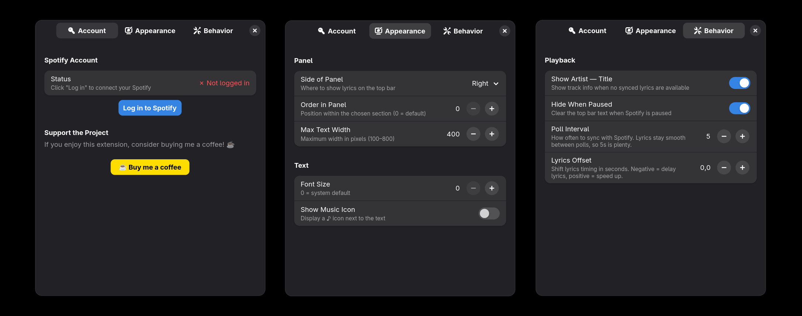
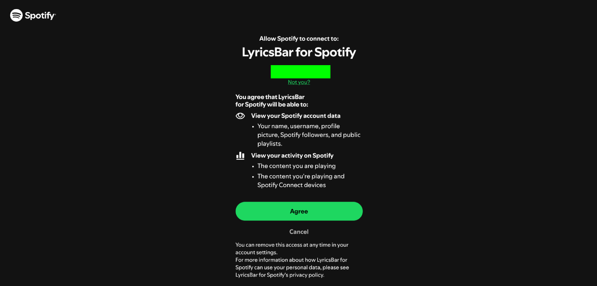

<p align="center">
  
</p>

<h3 align="center">Your top bar, now singing</h3>

<p align="center">
  A GNOME Shell extension that displays <b>real-time, word-synced Spotify lyrics</b> directly in your desktop panel — so you never have to leave what you're doing to follow along.
</p>


##  Showcase of the extension

<p align="center">
  <video width="800" controls>
    <source src="/images/vid1.mp4" type="video/mp4" />
  </video>
  <br/>
  <i>A showcase of how the extension works in practice</i>
</p>

##  Features

| Feature | Description |
|---|---|
| **Synced Lyrics** | Line-by-line lyrics update in real time as your music plays, powered by [LRCLIB](https://lrclib.net) |
| **Panel Placement** | Position lyrics on the **left**, **center**, or **right** side of the GNOME top bar, with configurable order index |
| **Customizable Look** | Adjust max text width, font size, and toggle the music icon on or off |
| **Smart Hiding** | Optionally hide the text when Spotify is paused |
| **Title Fallback** | Shows *Artist — Title* when no synced lyrics are available |
| **Lyrics Offset** | Fine-tune timing (±2 s) so lyrics match your audio perfectly |
| **Secure Auth** | OAuth 2.0 PKCE flow with refresh tokens stored in **GNOME Keyring** — no password ever touches disk |
| **Lightweight** | Smooth 200 ms UI refresh with configurable API poll interval (3–10 s) |

### Preferences Window

<p align="center">
  
</p>

The settings window has three tabs:
- **Account** — log in/out of Spotify and support the project
- **Appearance** — control where and how lyrics appear in the panel
- **Behavior** — configure playback sync, offset, and hide-when-paused

### Spotify Authorization

<p align="center">
  
</p>

When you click **Log in to Spotify**, your browser opens the **official Spotify authorization page**. Spotify asks you to confirm the permissions the extension needs (read your currently playing track). After clicking **Agree**, you are redirected back and the extension connects automatically — no password ever leaves Spotify's servers.

## Requirements

- **GNOME Shell 49**
- **Spotify Premium** account (required by the Spotify Web API for playback state)
- Active internet connection

## Installation

> [!NOTE]
> GNOME Extensions Store listing is coming soon! For now, install manually:

```bash
git clone https://github.com/Jachu7/LyricsBar.git
cd LyricsBar
mkdir -p ~/.local/share/gnome-shell/extensions/lyricsbar@Jachu7.github.io
cp -r * ~/.local/share/gnome-shell/extensions/lyricsbar@Jachu7.github.io/
```

Then restart GNOME Shell:
- **Wayland** — log out and back in
- **X11** — press <kbd>Alt</kbd>+<kbd>F2</kbd>, type `r`, press <kbd>Enter</kbd>

Enable the extension:

```bash
gnome-extensions enable lyricsbar@Jachu7.github.io
```

## Configuration

Open the settings via **Extensions** app or:

```bash
gnome-extensions prefs lyricsbar@Jachu7.github.io
```

### Account

#### Logging in to Spotify

1. Open the extension preferences and go to the **Account** tab.
2. Click the **Log in to Spotify** button.
3. Your **default browser** will open and take you to the **official Spotify authorization page** (`accounts.spotify.com`). This is Spotify's own website — the extension never sees your password.
4. Review the requested permissions (read your playback state) and click **Agree**.
5. Spotify redirects your browser to a local callback URL. The extension captures it, exchanges the code for an access token in the background, and stores it securely in the **GNOME Keyring**.
6. The status in the Account tab will change from *Not logged in* to your Spotify username — you're ready!

> [!NOTE]
> You can log out at any time by clicking **Log out** in the Account tab. This removes the stored token from the keyring.

### Appearance
- **Side of Panel** — Left / Center / Right
- **Order in Panel** — position index within the chosen section
- **Max Text Width** — 100–800 px
- **Font Size** — custom size or system default (0)
- **Show Music Icon** — toggle the ♪ icon

### Behavior
- **Show Artist — Title** — fallback when no synced lyrics are found
- **Hide When Paused** — clear the panel text when playback is paused
- **Poll Interval** — 3–10 seconds between Spotify API checks
- **Lyrics Offset** — shift lyrics timing by −2.0 to +2.0 seconds

## Architecture

```
lyricsbar@Jachu7.github.io/
├── extension.js        # Main extension lifecycle & polling loop
├── prefs.js            # Preferences window (Adw/Gtk4)
├── metadata.json       # Extension metadata
├── stylesheet.css      # Panel label styles
├── schemas/            # GSettings schema
└── src/
    ├── auth.js         # OAuth 2.0 PKCE flow + GNOME Keyring storage
    ├── spotify.js      # Spotify Web API client
    ├── lyrics.js       # LRCLIB lyrics fetcher & LRC parser
    └── ui.js           # Top-bar indicator widget
```

## Privacy & Security

- Authentication uses the **OAuth 2.0 Authorization Code with PKCE** flow — no client secret is needed.
- Refresh tokens are stored exclusively in the **GNOME Keyring** (via `libsecret`), never in plain text.
- The extension only requests the `user-read-playback-state` and `user-read-currently-playing` scopes — it **cannot** control playback or access your library.
- Lyrics are fetched from the open **LRCLIB** API; no personal data is sent.

## Contributing

Contributions, issues, and feature requests are welcome!
Feel free to open an [issue](https://github.com/Jachu7/LyricsBar/issues) or submit a pull request.

## Support

If you enjoy LyricsBar, consider supporting the project:

<a href="https://buymeacoffee.com/jachu7"></a>

---

<p align="center">Made with ❤️ for the GNOME community</p>
